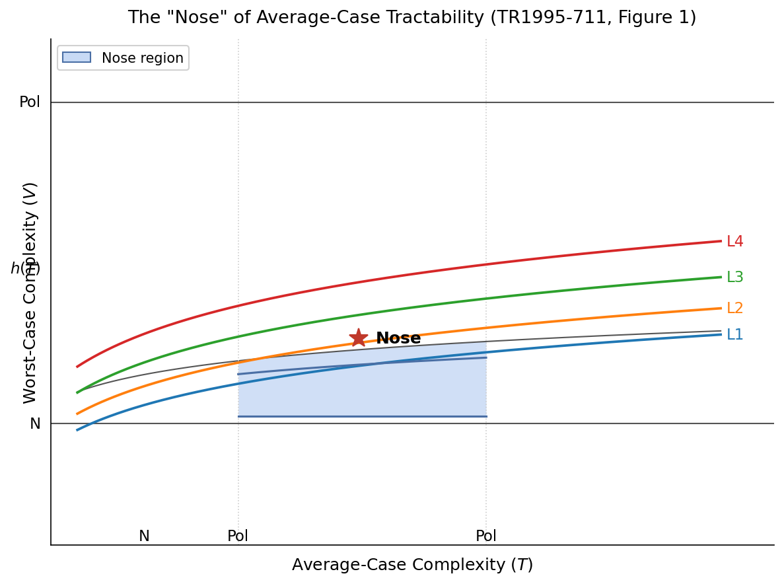

# Revisiting average case complexity of multilevel syllogistic: From the 1995 Courant Technical Report to Lean 4 Formalization

## 1. Introduction: The Vision of AvCom in Program Verification
In the late 1970s and throughout the 1980s, the "Correct Program Technology" (CPT) movement, spearheaded by figures such as Martin Davis and Jacob T. Schwartz, envisioned a software development pipeline where programmers wrote code alongside mathematical specifications [DS77]. A compiler, integrated with an automated theorem prover, would then verify that the program met its specification. 

To make this feasible, researchers sought to enrich Floyd-Hoare verification tools with decision procedures for decidable sublanguages of set theory and arithmetic. These logic fragments—such as Multilevel Syllogistic (MLS) and Elementary Multilevel Syllogistic (EMLS)—modeled the set-theoretic operations typical of high-level programming languages like SETL [Sny90a].

However, worst-case complexity analysis posed a major roadblock: the decision problems for MLS and EMLS are NP-complete, and extensions involving Presburger arithmetic exhibit exponential or double-exponential worst-case bounds. To bypass this, researchers pointed to early optimistic results by Goldberg [Gol79], which suggested that the Davis-Putnam procedure and resolution-based SAT solvers could perform exceptionally well on "average" inputs.

In their 1995 Courant Institute Technical Report, *"The average case complexity of multilevel syllogistic"* (TR1995-711), Jim Cox, Lars Ericson, and Bud Mishra analyze the average-case tractability of decidable sublanguages of set theory and arithmetic—such as Multilevel Syllogistic (MLS), Elementary Multilevel Syllogistic (EMLS), and Fractional Programming/Linear Programming (FP/LP). Because these languages are NP-complete in the worst case, the authors turn to the formal framework of **average-case complexity (AvCom)** to evaluate whether heuristic decision procedures could perform well on average. They marry the mathematical foundations of AvCom with set-theoretic decision procedures to determine whether a typical instance of these verification problems is truly tractable.

This note revisits that report in light of modern proof assistants. Our **proof program** is to establish the AvCom terms and concepts from the literature in Lean 4, formalize MLS and its decision procedures, and then grind out the TR1995-711 theorems—or document honestly where the effort stops. The goal is not to defend the 1995 report; it is to see what survives contact with a proof assistant.

### Proof program: outcomes we accept

| Outcome | What it means |
|---------|----------------|
| **Proofs check** | Definitions match the literature; TR1995-711 theorems are formalized and proved (possibly with explicitly stated hypotheses). |
| **Lean is not expressive enough (yet)** | We hit a clear blocker: missing Mathlib infrastructure, noncomputability, or encoding issues. Document the gap precisely. |
| **Paper proofs are wrong** | A step in TR1995-711 does not follow from definitions, or a reduction/domination bound fails. Document the counterexample or missing lemma. |
| **Field definitions are not solid** | Levin/RS93/distNP/AvP formulations are ambiguous, inconsistent, or not formalizable without arbitrary choices. Document the choice we had to make and what breaks. |

We do not treat `sorry` or axioms as success. Axioms are temporary scaffolding with a ticket to remove them.

### What TR1995-711 claims (targets)

The report **states proofs**, not conjectures, for:

- **NP-average completeness** of MLS satisfiability (Corollary 5.1), EMLS, FP/LP, and related fragments.
- **Distributional reductions** with domination, from bounded halting (NBH) and other distNP-complete cores.
- **Corollaries** tying average completeness to absence of AvP on simple POL-rankable distributions (conditional on standard collapse hypotheses such as NEXP $`\neq`$ EXP).

Our Lean development should eventually either prove these statements from formal definitions or refute a specific step. §9 grades each subphase (Phase 2A is complete; see Results).

### Phased plan

Context and Lean infrastructure appear in **§§2–4**; Phase 1 (AvCom) is **§5**, Phase 2 (MLS) is **§6**. Hardness and completeness (Phases 4–5) need both layers. Subphases track progress within each phase; §9 is the report card.

**Phase 0 — Infrastructure.** Lake project, smoke tests, paper synced to this document. *Status: complete.*

**Phase 1 — AvCom vocabulary (literature → Lean).**

| Subphase | Goal | Lean target |
|----------|------|-------------|
| **1A** | Inputs and distributions (§5) | `Bitstring`, `len`, `Distribution`, `DistributionalProblem`, `IsPolynomial` |
| **1B** | Rank and inverse bounds | `rank`, `T_inv` (no `sorry`; finite-support or explicit fork) |
| **1C** | Average time and dist-time classes | `IsAvTime`, `DistTime`, `AvDTime` |
| **1D** | Classes, reductions, completeness | `AvP`, `InDistNP`, `DistributionalReduction`, `IsNPAverageComplete` |

*Exit criterion (Phase 1):* all subphase definitions compile without `sorry`; basic lemmas and toy distribution tests; forks documented in `DEFINITION_FORKS.md`.

**Phase 2 — MLS embedding and decision procedure.**

| Subphase | Goal | Lean / doc |
|----------|------|------------|
| **2A** | MLS syntax + axiomatic semantics | §6, [`MLS.lean`](AvgCaseMls/MLS.lean)—`Term`, `Relation`, `Formula`, `evalTerm`, `evalFormula` |
| **2B** | EMLS literals, `literalToFormula`, `conjunctToFormula` | [`EMLS.lean`](AvgCaseMls/EMLS.lean), §6 |
| **2C** | FOS80 decision procedure for **satisfiability** | [`DecideMLS.lean`](AvgCaseMls/DecideMLS.lean), §7 |
| **2D** | Problem encoding and step count | `serializeFormula`, `SatMLS`, `stepsMLS` (remove axioms in §8) |

*Exit criterion (Phase 2):* 2A–2D complete; no `sorry` on soundness for the proved decision fragment; completeness scoped honestly.

**Phase 3 — Worst-case and coding.**

| Subphase | Goal |
|----------|------|
| **3A** | `SatMLS ∈ NP` (witness / certificate) |
| **3B** | Formula encoding size lemmas; polynomial bounds on $`|\varphi|`$ |

*Exit criterion:* formal NP membership or a written Mathlib blocker.

**Phase 4 — TR1995-711 reductions.**

| Subphase | Goal |
|----------|------|
| **4A** | NBH (or report’s distNP-complete core) + POL-rankable $`\mu_0`$ |
| **4B** | Reduction $`f`$, domination into `SatMLS` / EMLS / FP/LP |
| **4C** | **NP-average completeness** of `SatMLS` (Corollary 5.1) |

*Exit criterion:* 4C proved or a specific failed obligation recorded.

**Phase 5 — AvP consequences.**

| Subphase | Goal |
|----------|------|
| **5A** | Conditional non-AvP from completeness + simple rankable $`\mu`$ |
| **5B** | `SatMLS_average_hard` without `sorry`; axioms minimized |

### Methodology

1. **Definitions before theorems** — no `sorry` in defs we label “final.”
2. **One obligation per issue** — each former `sorry` becomes a named lemma with a one-line statement.
3. **Literature pointer** — every definition cites TR1995-711 section or [RS93], [Lev86], etc.
4. **Fork log** — if we must choose (finite support, encoding, POL-rankable vs P-computable), record in `DEFINITION_FORKS.md`.
5. **CI** — `./run_lean_check.sh` must pass; new sorries require a comment `-- Phase Nx, issue #…`.

We grind on Phases 1→5 in dependency order (subphases may be implemented out of order when independent). §§5–6 pair mathematics with Lean encodings; §4 covers Lean strategy; §§7–8 cover decision procedures and hardness theorems; §9 grades each subphase; §10 lists further directions.

---

## 2. Historical Context, Terminology, and Reception of TR1995-711

### Application and Findings
Cox, Ericson, and Mishra prove that **EMLS, MLS, and FP/LP are $`\text{NP}`$-average complete**. This implies there are simple, rankable distributions that will frustrate any decision algorithm for these problems, forcing super-polynomial average-case running times unless deterministic and nondeterministic exponential time are equal ($`\text{NEXP} = \text{EXP}`$).

### The Concept of "The Nose"
The paper features a key visualization of the average-case landscape of NP-complete languages (Figure 1, page 13).



**Figure 1 (schematic).** Languages L<sub>i</sub> are plotted by worst-case complexity *V* (vertical) and average-case complexity *T* (horizontal). The shaded **nose** is the tractable region in the polynomial–polynomial corner. 

In this diagram, languages $`L_i`$ are mapped based on their worst-case complexity $`V`$ (vertical axis) and their average-case complexity $`T`$ (horizontal axis). 
*   **The Nose** represents the sweet spot of tractability: the shaded region where the worst-case complexity of the ranking function $`V`$ is bounded by $`h(T)`$, such that the language still possesses an efficient average-case algorithm.
*   Formally, the authors define this boundary as:


```math
\text{nose}(L) = \{ (T, V) \in (\text{POL}, \text{POL}) : L \in \text{AvDTime}(T, V\text{-rankable}) \}
```


*   For an NP-average complete problem, the "nose" is trivial or empty under simple distributions, meaning no non-trivial efficient average-case behavior can be guaranteed unless $`\text{Nondeterministic Exp} = \text{Deterministic Exp}`$.

### Pre-publication review in 1995

Reviewer Martin Davis asked the authors to give a more pragmatic demonstration of their results before accepting the work into *Communications on Pure and Applied Mathematics* (CPAM). That demonstration never materialized; the concrete heuristics were weak, and the empirical machinery to test these algorithms on large datasets did not yet exist. The paper was never published in CPAM.

That outcome is not the whole story, however. The report's deeper aim was to supply a **language for describing how hard a typical instance of a verification problem might be**—not to ship a production solver. This historical episode highlights a common turning point in computer science during the mid-1990s: the tension between elegant, highly formal mathematical complexity theory and the messy, empirical reality of practical software engineering.

Three natural questions follow: Were the terms used in the paper invented there, or taken from existing literature? Was the technical report ever referenced? And what became of average-case complexity—and of this particular application to set-theoretic decision procedures—in the intervening thirty years?

### Were the Terms Invented in This Paper?
**No—the core definitions and terms were not invented in TR1995-711.** The authors drew entirely upon the existing complexity literature of the late 1980s and early 1990s:

*   **The foundations ($`\text{AvP}`$, $`\text{distNP}`$, and the domination condition):** Pioneered by Leonid Levin in his 1986 paper *"Average case complete problems"* [Lev86] and further formalized by Yuri Gurevich [Gur91] and Ben-David, Chor, Goldreich, and Luby [BDCGL89].
*   **The precise formulations ($`\text{POL}`$, $`\text{POL-rankable}`$, precise average-case complexity):** Taken directly from Rüdiger Reischuk and Christian Schindelhauer's 1993 paper, *"Precise average case complexity"* [RS93].

The report's contribution was not structural novelty in complexity theory itself, but rather its **application**: importing these rigorous, newly developed tools from structural complexity theory and applying them to automated theorem proving and program verification—specifically, showing that set-theoretic fragments such as EMLS and MLS are average-case complete.

### Was This Technical Report Ever Referenced?
In terms of direct scientific citations, **TR1995-711 has been almost entirely overlooked.** It has virtually zero standard citations in academic journals and did not spawn a direct lineage of follow-up papers in automated theorem proving.

It has nevertheless been kept alive in a specific way: it is cited as a notable applied example on the **Wikipedia page for "Average-case complexity"** (and its translations). Because Wikipedia editors documented it as one of the few explicit applications of Levin's theory to set-theoretic decision procedures, it remains a known historical reference point in the literature of the field.

---

## 3. Thirty Years of Average-Case Complexity (1995–2026)

Rather than dying, the field of average-case complexity underwent a massive evolution. Its center of gravity migrated away from traditional decision-procedure analysis and became foundational to other, highly successful domains.

### Cryptography and Worst-Case-to-Average-Case Reductions
In the late 1990s—beginning with Miklós Ajtai's landmark 1996 work [Ajt96]—theorists discovered how to prove mathematically that certain average-case problems are hard *assuming only that their worst-case versions are hard*. This paved the way for **lattice-based cryptography** and Oded Regev's **Learning With Errors (LWE)** framework (2005) [Reg05]. Because cryptography requires that *almost all* generated keys are hard to break (average-case hardness), these frameworks are now the basis for modern post-quantum cryptography standards.

### Smoothed Analysis
In 2001, Daniel Spielman and Shang-Hua Teng introduced **smoothed analysis** [ST01]. They argued that analyzing an algorithm under a purely random, mathematically convenient distribution (the "average case") is often unrealistic and overly pessimistic. Instead, they measured performance under *slight random perturbations of worst-case inputs*. This successfully explained why algorithms like the Simplex method for linear programming run in polynomial time in practice despite worst-case exponential complexity—bridging the gap between theory and practical heuristics in a way that Levin-style rankable distributions alone could not.

### Statistical Inference and Machine Learning
In the 2010s and 2020s, average-case complexity found a major new home in high-dimensional statistics and machine learning. Researchers now study the **information–computation gap**—situations where an estimation problem (such as the Planted Clique problem or Tensor PCA) is theoretically solvable given infinite time, but computationally intractable on average for any polynomial-time algorithm.

### What Happened to This Specific Use Case (Set-Theoretic Decision Procedures)?
Martin Davis's skepticism was vindicated by the path the automated theorem proving community took. The attempt to build program verification tools around highly specialized, decidable, average-case-analyzed set-theoretic sublanguages (such as EMLS or MLS) largely became a dead end. The community pivoted instead toward **SMT (Satisfiability Modulo Theories) solvers** (such as Z3 and CVC5) [deM08] and modern **SAT solvers**.

This transition succeeded for several reasons:

*   **The structure of real-world code:** Theoretical average-case complexity assumes random inputs under simple mathematical distributions (such as the linear-time rankable distributions in Cox et al.'s paper). Real-world software verification problems, however, are highly structured and logical; they are not random.
*   **The triumph of CDCL and heuristics:** Modern SMT/SAT solvers utilize Conflict-Driven Clause Learning (CDCL) and highly engineered heuristics. Empirically, these tools routinely solve industrial-scale verification formulas with millions of variables, bypassing theoretical worst-case or average-case intractability.
*   **Empirical benchmarks over proofs:** Rather than proving mathematical average-case tractability, the community created massive, standardized libraries of real-world problem benchmarks (such as SMT-LIB). Solver progress is now measured empirically—a far more pragmatic and successful path than the one Davis requested for CPAM.

The specific marriage of AvCom to MLS decision procedures was largely abandoned for the same reason: proving average-case hardness under mathematically simple, rankable distributions did not reflect the highly structured formulas generated by real-world compilers.

The specific marriage of AvCom to MLS decision procedures was largely abandoned for the same reason: proving average-case hardness under mathematicically simple, rankable distributions did not reflect the highly structured formulas generated by real-world compilers.

---

## 4. Lean 4 Formalization Strategy

§§5–6 pair the mathematical definitions with their Lean modules. This section summarizes project infrastructure and design choices. The live code lives in [`AvgCaseMls/`](AvgCaseMls/) and is checked by `./run_lean_check.sh` and `./run_lean_tests.sh` (see [`INSTALLING_LEAN.md`](INSTALLING_LEAN.md)).

### Mathlib and the Complexity-Theory Gap
Through 2025–2026, Mathlib4 has begun to host **worst-case** complexity infrastructure (polynomial-time Turing machines, $`\text{P}`$, $`\text{NP}`$, and related material under active development). **Average-case complexity—distributional problems, rank functions, $`\text{Av}(T)`$, $`\text{DistTime}`$, distributional reductions, and $`\text{AvP}`$—is not yet a standard Mathlib layer.** TR1995-711 is therefore a natural stress test: it requires both a deep embedding of set-theoretic syntax *and* a bespoke AvCom library built on [RS93].

Our approach mirrors [icon2lean](https://github.com/catskillsresearch/icon2lean):
1. **Definitions first** — encode $`\text{rank}`$, $`\text{Av}(T)`$, $`\text{DistTime}(T)`$, $`\text{AvP}`$, and $`\text{distNP}`$ alongside the AvCom definitions in §5.
2. **Deep embedding of MLS/EMLS** — inductive syntax + semantic evaluation in §6.
3. **Decision procedure skeleton** — a computable `decideMLS` with stated soundness/completeness for **satisfiability**, plus a future **step-counting** function to relate the model-graph algorithm to $`\text{Av}(T)`$ (§7).
4. **Hardness statements** — structural theorems such as `SatMLS_average_hard` with explicit `sorry` placeholders until reductions from TR1995-711 are formalized (§8).

### Design Choices for Executable vs. Proof Layer
| Concept | Lean representation | Rationale |
|---------|---------------------|-----------|
| Inputs | `Bitstring := List Bool`, `len` | Matches $`\Sigma = \{0,1\}`$ encodings in the report |
| Distributions | `structure Distribution` with `Finset` sums $`\leq 1`$ | Avoids infinite sums; enough for rank-based definitions |
| Rank | `noncomputable def rank` | Cardinality over all strings is not computable |
| Set semantics | Axiomatic `MLS.ZFSet` + `noncomputable evalTerm` | Supports nested sets without committing to full ZF in Mathlib; `Mathlib.Data.ZFC.Basic` is an alternative for a future refactor |
| EMLS | Elementary literals in §6 grammar; optional separate `EMLS.Literal` inductive (planned) | EMLS is the normal form the model-graph algorithm consumes |
| Tests | `#eval` + `native_decide` on decidable fragments | Same regression pattern as `Icon2lean/Tests.lean` |

---

## 5. Average-Case Complexity (AvCom): Theory, Classes, and Lean Encoding

The formal definitions in this section follow TR1995-711 §3.2 ([`TR1995-711.pdf`](TR1995-711.pdf)). In the mid-1990s, structural average-case complexity was a young, highly mathematical field. Each mathematical definition below is paired with its Lean counterpart in [`AvgCaseMls/AvCom.lean`](AvgCaseMls/AvCom.lean) where it exists today. 

### Why Naive Averaging Fails
Prior to Leonid Levin’s 1986 breakthrough [Lev86], researchers measured average running time naively:


```math
\text{Time}_M^{\mu}(n) = \sum_{|x|=n} \mu_n(x) \text{time}_M(x)
```


As noted by Ben-David et al. [BDCGL89] and Gurevich, this formulation is deeply flawed:
*   **Model-dependent and encoding-dependent:** Slight changes in the binary representation of inputs radically alter the average complexity.
*   **Not closed under functional composition:** An algorithm that runs in average $`O(n)`$ time can yield an average-case exponential runtime when composed with a polynomial-time pre-processing step.

Simply taking the expected running time of an algorithm weighted over all inputs of size $`n`$ is therefore inadequate as a robust complexity measure.

### Levin's Robust Formulation
Levin solved these issues with a robust notion of "polynomial time on average." Under this framework, a running time $`T(x)`$ is average-polynomial under a distribution $`\mu`$ if there is a constant $`c > 0`$ such that the expected value of $`T(x)^{1/c} / |x|`$ is finite:


```math
\sum_{x} \mu(x) \frac{T(x)^{1/c}}{|x|} < \infty
```


Rather than analyzing a language in isolation, average-case complexity pairs a language $`L`$ (a decision problem) with a probability distribution $`\mu`$ on its instances, denoted as the distributional problem $`(L, \mu)`$.

### Reischuk-Schindelhauer's Precise Classes
In 1993, Reischuk and Schindelhauer [RS93] streamlined Levin's theory by introducing **ranking functions** to capture the distribution profile. Cox, Ericson, and Mishra rely primarily on the average-case analogues of $`\text{P}`$ and $`\text{NP}`$ under both Levin's traditional definitions and this precise average-case framework. TR1995-711 §3.2 notes explicitly that terminology in this area had **not yet been standardized** in the literature even in 1995; the report follows [RS93] and cites [Lev86, BDCGL89, Gur91, VR92, SY92].

The subsections below collect the definitions as used in the report, with Lean encodings interleaved.

### Inputs, Distributions, and Rank
Fix a finite alphabet $`\Sigma`$ (in practice $`\Sigma = \{0,1\}`$). An **input** is a string $`x \in \Sigma^*`$, with **length** $`|x|`$ (in Lean we use `Bitstring := List Bool` and `len s := s.length`).

A **probability distribution** on $`\Sigma^*`$ is a function $`\mu : \Sigma^* \to [0,1]`$ such that $`\sum_x \mu(x) \leq 1`$ and $`\mu(x) \geq 0`$ for all $`x`$. In the Lean sketch we axiomatize this with finite `Finset` sums rather than infinite series, which is adequate for the rank-based definitions that follow.

A **distributional problem** is a pair $`(L, \mu)`$ where $`L \subseteq \Sigma^*`$ is a decision problem (language) and $`\mu`$ is a distribution on its instances.

The **rank** of $`x`$ under $`\mu`$ counts how many inputs are at least as probable as $`x`$:


```math
\text{rank}_{\mu}(x) = \bigl|\{ z \in \Sigma^* : \mu(z) \geq \mu(x) \}\bigr|
```


When $`\mu(x) = 0`$, the rank is taken to be $`0`$ (inputs of measure zero carry no average-case weight). In Lean, `rank` is marked `noncomputable` because counting over all strings is not executable; for tests one restricts to finite supports.

### Complexity Bounds, POL, and Rankable Distributions
Following [RS93], let **POL** denote the class of **polynomial complexity bounds**—functions $`T : \mathbb{N} \to \mathbb{N}`$ such that $`T(n) \leq c n^k + c`$ for some constants $`c, k`$ (formalized in Lean as `IsPolynomial`).

A distribution $`\mu`$ is **$`T`$-rankable** if $`\text{rank}_{\mu}(x) \leq T(|x|)`$ for all $`x`$.

A distribution $`\mu`$ is **POL-rankable** if it is $`T`$-rankable for some $`T \in \text{POL}`$ **and** the rank function $`\text{rank}_{\mu}(x)`$ is computable in deterministic polynomial time (in binary). TR1995-711 uses POL-rankable distributions throughout its hardness constructions.

A real-valued function $`m : [0,1] \to [0,1]`$ is **monotone** if $`x < y`$ implies $`m(x) < m(y)`$. A **monotone transformation** of a distribution $`\mu`$ is a reweighting $`m \circ \mu`$ obtained from such an $`m`$ with $`\sum_x m(\mu(x)) < 1`$. Levin's original average-time definition quantifies over all monotone transformations of $`\mu`$; [RS93] shows this is equivalent to a simpler rank-sum condition (below).

### Levin's $`\mu`$-Average Time and the RS93 Alternative
Let $`f : \Sigma^* \to \mathbb{N}`$ be a running-time function and $`T : \mathbb{N} \to \mathbb{N}`$ a monotone complexity bound with **generalized inverse** $`T^{-1}(m) = \min\{ n : T(n) \geq m \}`$.

**Levin's formulation (conceptual):** the pair $`(f, \mu)`$ lies in $`\text{Av}(T)`$ if, for every monotone transformation $`m`$ of $`\mu`$, a certain $`T^{-1}`$-weighted expectation remains bounded. This formulation is robust but references all monotone reweightings of $`\mu`$ and is awkward to formalize directly.

**Reischuk–Schindelhauer alternative (used in TR1995-711):** $`(f, \mu) \in \text{Av}(T)`$ if for all integers $`\ell \geq 1`$,


```math
\sum_{\text{rank}_{\mu}(x) \leq \ell} \frac{T^{-1}(f(x))}{|x|} \leq \ell
```


This is the definition implemented structurally in `AvgCaseMls/AvCom.lean` as `IsAvTime`. Intuitively, high-rank (low-probability) inputs may take large time $`f(x)`$, but the inverse-bound mass $`T^{-1}(f(x))`$ per bit of input cannot accumulate faster than the rank budget $`\ell`$.

### Average Complexity Classes
Let $`M`$ be a deterministic Turing machine with running time $`f_M(x)`$ on input $`x`$.

*   **$`\text{DistTime}(T)`$:** the class of distributional problems $`(L, \mu)`$ for which there exists a deterministic algorithm $`M`$ deciding $`L`$ such that $`(f_M, \mu) \in \text{Av}(T)`$.
*   **$`\text{AvDTime}(T, C)`$:** as above, but restricting $`\mu`$ to be **$`C`$-rankable** distributions (for a complexity class $`C`$ of rank bounds). This class drives the **"nose"** diagram: languages tractable on average when the ranking function of the distribution is itself bounded by $`V \in \text{POL}`$.
*   **$`\text{AvP}`$ (Average Polynomial Time):** $`\text{DistTime}(\text{POL}, \text{POL-rankable})`$—distributional problems efficiently solvable on average over POL-rankable $`\mu`$. Equivalently: $`(L, \mu) \in \text{AvP}`$ if $`L`$ is decidable in average polynomial time under a POL-rankable distribution.
*   **$`\text{distNP}`$ (also written $`\text{NP}^{\text{dist}}`$ in the report):** $`\{(L, \mu) : L \in \text{NP},\ \mu \in \text{POL-rankable}\}`$. Membership in $`\text{NP}`$ means witnesses are verifiable in polynomial time on a nondeterministic Turing machine (NTM).

Under this framework, Cox, Ericson, and Mishra utilize several precise complexity classes:

*   **$`\text{POL-rankable}`$ Distributions:** As defined above—polynomial rank bound plus polynomial-time rank computation.
*   **$`\text{Av}(T)`$ (Average Time $`T`$):** Pairs $`(f, \mu)`$ satisfying the RS93 rank-sum inequality; for a machine deciding $`L`$, require $`(f_M, \mu) \in \text{Av}(T)`$.
*   **$`\text{AvP}`$ (Average Polynomial Time):** $`\text{DistTime}(\text{POL}, \text{POL-rankable})`$—distributional problems $`(L, \mu)`$ efficiently solvable on average over POL-rankable distributions.
*   **$`\text{distNP}`$ (Distributional NP):** $`\{(L, \mu) : L \in \text{NP},\ \mu \in \text{POL-rankable}\}`$ (the report also discusses $`\text{P}`$-computable and $`\text{P}`$-samplable distributions in the broader literature).

### Distributional Reductions and NP-Average Completeness
To transfer hardness results between average-case problems, TR1995-711 §3.2 defines **distributional reductions**. A reduction from $`(L_1, \mu_1)`$ to $`(L_2, \mu_2)`$ is a polynomial-time computable function $`f : \Sigma^* \to \Sigma^*`$ such that:

1. **Correctness:** $`x \in L_1 \iff f(x) \in L_2`$ for all $`x`$.
2. **Domination:** letting $`p_i(x) = \text{rank}_{\mu_i}(x)`$, there exist constants $`c_0, c_1 > 0`$ such that


```math
p_2(f(x)) \leq c_0 |x|^{c_1} p_1(x)
```


for all $`x`$.

The domination condition ensures that if $`(L_2, \mu_2)`$ is solvable in average polynomial time, tractability is preserved for $`(L_1, \mu_1)`$: $`f`$ cannot map many low-rank inputs of $`\mu_1`$ into disproportionately high-rank images under $`\mu_2`$.

A distributional problem $`(L, \mu)`$ is **NP-average complete** (NP-distributional complete) if:
* $`(L, \mu) \in \text{distNP}`$, and
* every $`(L', \mu') \in \text{distNP}`$ is distributionally reducible to $`(L, \mu)`$.

TR1995-711 Corollary 5.1 (page 12) states that **MLS satisfiability** is NP-average complete; related corollaries cover EMLS, FP/LP, and further set-theoretic fragments. The proofs combine distributional reductions from bounded halting for NTMs with the rankable distributions constructed in the report.

### Lean encoding (Phases 1A–1D)

Here we translate TR1995-711 §3.2 into Lean 4 using the RS93 rank-sum definition of $`\text{Av}(T)`$. The module [`AvgCaseMls/AvCom.lean`](AvgCaseMls/AvCom.lean) currently defines:

* `Bitstring`, `len` — inputs $`x \in \{0,1\}^*`$ and length $`|x|`$;
* `Distribution` — probability mass with non-negativity and finite `Finset` sum $`\leq 1`$;
* `rank` — placeholder for $`\text{rank}_\mu(x)`$ (Phase **1B**);
* `T_inv` — placeholder for the generalized inverse $`T^{-1}`$ (Phase **1B**);
* `IsAvTime` — the RS93 rank-sum condition (Phase **1C**);
* `DistributionalProblem`, `IsPolynomial`, `AvP` — structural counterparts of $`\text{DistTime}(\text{POL}, \text{POL-rankable})`$ (Phase **1D**).

Planned extensions (not yet in the repository): `DistTime`, `AvDTime`, `InDistNP`, `DistributionalReduction`, and `IsNPAverageComplete`. These will let us state TR1995-711 Corollary 5.1 as a theorem rather than a comment (§8).

```lean
import Mathlib.Data.Real.Basic
import Mathlib.Algebra.BigOperators.Group.Finset.Basic

open Finset

abbrev Bitstring := List Bool

def len (s : Bitstring) : Nat := s.length

structure Distribution where
  prob : Bitstring → Real
  nonneg : ∀ s, 0 ≤ prob s
  sum_le_one : ∀ (F : Finset Bitstring), F.sum prob ≤ 1

noncomputable def rank (μ : Distribution) (x : Bitstring) : Nat :=
  if μ.prob x = 0 then 0
  else
    -- Conceptually: |{ z : μ.prob z ≥ μ.prob x }|
    sorry

def T_inv (T : Nat → Nat) (m : Nat) : Nat :=
  sorry

def IsAvTime (T : Nat → Nat) (f : Bitstring → Nat) (μ : Distribution) : Prop :=
  ∀ (l : Nat), l ≥ 1 →
    ∃ (S : Finset Bitstring),
      (∀ x, x ∈ S ↔ rank μ x ≤ l) ∧
      S.sum (fun x => (T_inv T (f x) : Real) / (len x : Real)) ≤ (l : Real)

structure DistributionalProblem where
  L : Set Bitstring
  μ : Distribution

def IsPolynomial (T : Nat → Nat) : Prop :=
  ∃ (c k : Nat), ∀ n, T n ≤ c * n^k + c

def AvP (prob : DistributionalProblem) : Prop :=
  ∃ (f : Bitstring → Nat) (T : Nat → Nat),
    IsPolynomial T ∧ IsAvTime T f prob.μ

/- Planned: DistTime, AvDTime, distNP membership, distributional reductions -/
```

---

## 6. Multilevel Syllogistic (MLS): Grammar and Lean Encoding

### Syntax of MLS and EMLS
Multilevel Syllogistic (MLS) is a decidable fragment of Zermelo-Fraenkel set theory. Its syntax allows set variables, the empty set ($`\emptyset`$), binary set operators (union $`\cup`$, intersection $`\cap`$, set difference $`\setminus`$), binary set relations (membership $`\in`$, non-membership $`\notin`$, equality $`=`$, inequality $`\neq`$), and standard propositional connectives.

The grammar is formally defined as:
*   **Terms:** $`T \to v_i \mid \emptyset \mid T \cup T \mid T \cap T \mid T \setminus T`$
*   **Literals:** $`L \to T \in T \mid T \notin T \mid T = T \mid T \neq T`$
*   **Formulas:** $`\Phi \to L \mid \neg \Phi \mid \Phi \land \Phi \mid \Phi \lor \Phi \mid \Phi \Rightarrow \Phi \mid \Phi \equiv \Phi`$

**Elementary Multilevel Syllogistic (EMLS)** simplifies the terms by restricting conjuncts to "flat" elementary literals:


```math
v_i = \emptyset, \quad v_i = v_j \cup v_k, \quad v_i = v_j \setminus v_k, \quad v_i = v_j \cap v_k, \quad v_i \in v_j, \quad v_i \notin v_j, \quad v_i \neq v_j
```


### Lean encoding (Phase 2A)

**Scope.** This subsection is **complete** for its current goal: a deep embedding of full MLS syntax and axiomatic set-theoretic semantics in Lean 4. [`AvgCaseMls/MLS.lean`](AvgCaseMls/MLS.lean) compiles with no `sorry`. Phase **2B** (EMLS literals in [`AvgCaseMls/EMLS.lean`](AvgCaseMls/EMLS.lean)), **2C** (decision procedure, §7), and **2D** (serialization and step counting, §8) are separate obligations.

Set variables are identified with natural-number indices (`Nat → ZFSet` environments), matching the report's $`v_i`$ notation. MLS formulas talk about membership chains $`v_i \in v_j \in v_k \in \cdots`$. We use a custom axiomatized `ZFSet` sort so the development is self-contained and `evalTerm`/`evalFormula` are explicitly `noncomputable` (axioms are not compiled). A Mathlib-backed refactor would replace `axiom ZFSet` with imports from `Mathlib.Data.ZFC.Basic`.

The listing below matches [`AvgCaseMls/MLS.lean`](AvgCaseMls/MLS.lean).

```lean
-- Define the logical and syntactic structures of MLS in Lean 4

namespace MLS

/- 1. Syntactic Terms -/
inductive Term : Type
  | var   : Nat → Term
  | empty : Term
  | union : Term → Term → Term
  | inter : Term → Term → Term
  | diff  : Term → Term → Term
  deriving DecidableEq, Repr

/- 2. Set-Theoretic Relations -/
inductive Relation : Type
  | mem     : Term → Term → Relation
  | not_mem : Term → Term → Relation
  | eq      : Term → Term → Relation
  | neq     : Term → Term → Relation
  deriving DecidableEq, Repr

/- 3. Propositional Formulas -/
inductive Formula : Type
  | rel : Relation → Formula
  | not : Formula → Formula
  | and : Formula → Formula → Formula
  | or  : Formula → Formula → Formula
  | imp : Formula → Formula → Formula
  | iff : Formula → Formula → Formula
  deriving DecidableEq, Repr

/- 4. Axiomatic Semantics -/
axiom ZFSet : Type

axiom ZFSet.empty : ZFSet
axiom ZFSet.union : ZFSet → ZFSet → ZFSet
axiom ZFSet.inter : ZFSet → ZFSet → ZFSet
axiom ZFSet.diff  : ZFSet → ZFSet → ZFSet
axiom ZFSet.mem   : ZFSet → ZFSet → Prop

def Env : Type := Nat → ZFSet

noncomputable def evalTerm (env : Env) : Term → ZFSet
  | Term.var n       => env n
  | Term.empty       => ZFSet.empty
  | Term.union t1 t2 => ZFSet.union (evalTerm env t1) (evalTerm env t2)
  | Term.inter t1 t2 => ZFSet.inter (evalTerm env t1) (evalTerm env t2)
  | Term.diff t1 t2  => ZFSet.diff (evalTerm env t1) (evalTerm env t2)

noncomputable def evalFormula (env : Env) : Formula → Prop
  | Formula.rel (Relation.mem t1 t2)     => ZFSet.mem (evalTerm env t1) (evalTerm env t2)
  | Formula.rel (Relation.not_mem t1 t2) => ¬ ZFSet.mem (evalTerm env t1) (evalTerm env t2)
  | Formula.rel (Relation.eq t1 t2)      => evalTerm env t1 = evalTerm env t2
  | Formula.rel (Relation.neq t1 t2)     => evalTerm env t1 ≠ evalTerm env t2
  | Formula.not f                        => ¬ evalFormula env f
  | Formula.and f1 f2                    => evalFormula env f1 ∧ evalFormula env f2
  | Formula.or f1 f2                     => evalFormula env f1 ∨ evalFormula env f2
  | Formula.imp f1 f2                    => evalFormula env f1 → evalFormula env f2
  | Formula.iff f1 f2                    => evalFormula env f1 ↔ evalFormula env f2

end MLS
```

**EMLS (Phase 2B).** Elementary literals and translation into MLS live in [`AvgCaseMls/EMLS.lean`](AvgCaseMls/EMLS.lean), following Ferro–Omodeo–Schwartz [FOS80] §3 ([`3-540-10009-1_8.pdf`](3-540-10009-1_8.pdf)):

```lean
inductive BinOp | union | inter | diff

inductive Literal
  | eqOp    : Nat → Nat → Nat → BinOp → Literal  -- x = y ∪/∩/\ z
  | eqEmpty : Nat → Literal
  | mem | notMem | neq : Nat → Nat → Literal

def literalToFormula : Literal → Formula
def conjunctToFormula : List Literal → Option Formula
```

Normalization from general MLS formulas to EMLS conjuncts remains partial (`formulaToConjunct?` in §7); the model-graph decision procedure is §7 only.

---

## 7. Decision Procedures for MLS and EMLS in Lean 4

Phase **2C.** This section merges the decision-procedure mathematics with the Lean encoding. The primary reference is Ferro, Omodeo, and Schwartz [FOS80]—*Decision procedures for some fragments of set theory*—as reproduced in [`3-540-10009-1_8.pdf`](3-540-10009-1_8.pdf) (§3: multilevel syllogistic without singleton or cardinality). TR1995-711 and §6 cite the same **model-graph / elementary-literal** pipeline.

### Problem shape (FOS80 §3)

Validity of an MLS formula reduces to satisfiability of a **conjunction** $`q`$ of elementary literals over set variables $`x,y,z,\ldots`$:

| Form | Literal |
|------|---------|
| $(*)$ | $`x = y \diamond z`$ with $`\diamond \in \{\cup,\cap,\setminus\}`$ |
| $(\in)$ | $`x \in y`$ |
| $(\notin)$ | $`x \notin y`$ |
| $(\neq)$ | $`x \neq y`$ |

Let $`q^*`$ be the sub-conjunction of $(*)$ literals, $`V_{\in}`$ the variables appearing on the left of $(\in)$ / $(\notin)$ literals, and $`L_x`$ the literals whose left-hand side is $`x`$.

### Algorithm outline ([FOS80] §3)

1. **Step 1 (substitution):** For each $`x \in V_{\in}`$, expand $`L_x`$ using $(\neq)$ literals and merge equivalence classes from $`q^*`$; replace membership literals $`x \in y`$, $`x \notin y`$ accordingly.
2. **Step 2:** If any literal $`x \neq x`$ appears, return **UNSATISFIABLE**.
3. **Step 3:** If $`V_{\in}`$ is empty, return **SATISFIABLE**.
4. **Step 4:** Search for a **singleton model** (every variable interpreted as a subset of $`\{\emptyset\}`$) by assigning an ordering $`x < y`$ when $`M(x) \in M(y)`$; detect cycles (e.g. $`x \in y \land y \in z \land z \in x`$) as unsatisfiable. In the worst case TR1995-711 cites $`2^{4n^3}`$ candidate models for $`n`$ variables.

[FOS80] §4 extends the language with singletons, cardinality, and arithmetic; we do **not** encode that extension yet.

### Lean modules

| File | Role |
|------|------|
| [`AvgCaseMls/EMLS.lean`](AvgCaseMls/EMLS.lean) | `Literal`, `Conjunct`, `literalToFormula`, `conjunctToFormula` |
| [`AvgCaseMls/DecideMLS.lean`](AvgCaseMls/DecideMLS.lean) | `formulaToConjunct?`, `decideConjunct`, `decideMLSSat`, soundness/completeness |

**Implemented today:** partial normalization (`formulaToConjunct?` on conjunctions of flat literals), FOS80 **Step 2** contradictions ($`x \neq x`$, $`x \in y \land x \notin y`$), **Step 3** (no membership literals ⇒ SAT), and a **partial Step 4** (membership-order cycle detection). **Open:** full Step 1 substitution, complete singleton-model search, and proofs.

**Satisfiability** (not validity):

* **Soundness:** if `decideMLSSat φ = true`, then $`\exists env,\ \text{evalFormula}\ env\ \varphi`$.
* **Completeness:** if $`\varphi`$ is satisfiable, then `decideMLSSat φ = true` (on the implemented fragment).

```lean
namespace MLS

open EMLS

def decideConjunct (c : Conjunct) : Bool := …  -- Steps 2–4 (partial)

def decideMLSSat (f : Formula) : Bool :=
  match formulaToConjunct? f with
  | some c => decideConjunct c
  | none => …  -- fallback on degenerate literals

theorem decideMLSSat_sound (f : Formula) (h : decideMLSSat f = true) :
    ∃ (env : Env), evalFormula env f := by sorry

theorem decideMLSSat_complete (f : Formula) (h : ∃ (env : Env), evalFormula env f) :
    decideMLSSat f = true := by sorry
```

The live implementation is [`AvgCaseMls/DecideMLS.lean`](AvgCaseMls/DecideMLS.lean). A **step-counting** function `stepsMLS` (Phase 2D) will relate the procedure to $`\mathrm{Av}(T)`$ in §5.

---

## 8. Lean 4 Verification: Proving Average-Case Hardness Properties
Phase **2D** (encoding) and **5B** (hardness theorem). The AvCom classes are defined in §5; MLS syntax is in §6. The 1995 paper proves that the satisfiability of MLS formulas is **NP-average complete**. Under the defined AvCom classes, this implies that MLS cannot belong to $`\text{AvP}`$ under certain rankable distributions unless the nondeterministic and deterministic exponential-time hierarchies collapse.

We can represent this theorem structurally in Lean 4:

```lean
-- Abstract representation of the non-triviality of the "Nose" of MLS

axiom NEXP_neq_EXP : Prop -- Nondeterministic Exponential Time != Deterministic Exponential Time

-- Map an MLS Formula to its binary representation
axiom serializeFormula : MLS.Formula → Bitstring

-- The language of satisfiable MLS formulas
def SatMLS : Set Bitstring :=
  { s | ∃ (f : MLS.Formula), serializeFormula f = s ∧ ∃ (env : MLS.Env), MLS.evalFormula env f }

/-
  Theorem 5.1 (adapted): SatMLS is NP-average complete.
  Consequently, there exists a simple, polynomial-time rankable distribution μ 
  under which (SatMLS, μ) is not in AvP, assuming NEXP ≠ EXP.
-/
theorem SatMLS_average_hard (μ : Distribution) (h_rank : ∃ T, IsPolynomial T ∧ ∀ x, rank μ x ≤ T (len x)) :
    NEXP_neq_EXP → ¬ AvP ⟨SatMLS, μ⟩ := by
  intro h_collapse h_avp
  -- The proof sketch reduces the bounded halting problem for NTMs (NBH)
  -- to SatMLS, showing that if SatMLS was in AvP, NBH would be in AvP,
  -- collapsing NEXP to EXP.
  sorry
```

---

## 9. Results
§9 is the **report card** for the proof program. Each row is a **subphase** from §1. **Outcome** is **TBD** while work is in progress, or one of the four accepted outcomes (*Proofs check*; *Lean is not expressive enough (yet)*; *Paper proofs are wrong*; *Field definitions are not solid*). Phase 0 (infrastructure) is complete and not graded here.

| Phase | Phase goal | Outcome |
|-------|------------|---------|
| **1A** | `Bitstring`, `len`, `Distribution`, `DistributionalProblem`, `IsPolynomial`—scaffolding in [`AvCom.lean`](AvgCaseMls/AvCom.lean); defs not yet declared final | TBD |
| **1B** | `rank`, `T_inv` without `sorry`; finite-support convention or fork documented | TBD |
| **1C** | `IsAvTime`, `DistTime`, `AvDTime` | TBD |
| **1D** | `AvP`, `InDistNP`, `DistributionalReduction`, `IsNPAverageComplete` | TBD |
| **2A** | MLS syntax + axiomatic semantics (§6, [`MLS.lean`](AvgCaseMls/MLS.lean)) | Proofs check |
| **2B** | EMLS literals, `literalToFormula`, `conjunctToFormula` ([`EMLS.lean`](AvgCaseMls/EMLS.lean)) | TBD |
| **2C** | `decideMLSSat`, FOS80 Steps 2–4 partial ([`DecideMLS.lean`](AvgCaseMls/DecideMLS.lean)) | TBD |
| **2D** | `serializeFormula`, `SatMLS`, `stepsMLS` (§8 axioms removed) | TBD |
| **3A** | `SatMLS ∈ NP` or Mathlib blocker | TBD |
| **3B** | Encoding size / $`|\varphi|`$ lemmas | TBD |
| **4A** | NBH (or report core) + POL-rankable $`\mu_0`$ | TBD |
| **4B** | Reduction + domination into `SatMLS` | TBD |
| **4C** | NP-average completeness (Corollary 5.1) | TBD |
| **5A** | Conditional non-AvP from completeness | TBD |
| **5B** | `SatMLS_average_hard` without `sorry` | TBD |

*Last updated: Phase 2A graded **Proofs check** (`MLS.lean` builds, no `sorry`); all other subphases TBD.*

---

## 10. Suggestions for Future Work
Building on this integration of automated theorem proving and structural complexity, several avenues for future work emerge:

1.  **Formalizing Smoothed Analysis in Lean 4:**
    While average-case complexity under fixed distributions can be overly pessimistic, formalizing Spielman-Teng smoothed analysis would allow researchers to verify the typical-case tractability of modern SAT/SMT algorithms under random perturbations.
2.  **Verified SMT Solvers with Monadic Cost Models:**
    One could implement an executable SMT solver in Lean 4 (using a monadic state to track recursive steps) and formally prove that it runs in polynomial time on structured, non-random formula distributions.
3.  **Extending Mathlib's Complexity Library:**
    The current complexity theory developments in Mathlib4 are focused on worst-case bounds. Standardizing Levin's structural average-case reductions, the domination condition, $`\text{DistTime}`$, $`\text{AvDTime}`$, and $`\text{AvP}`$ in Mathlib would provide a robust framework for certifying post-quantum security and for revisiting TR1995-711-style applied completeness proofs.
4.  **Step-counting the model-graph procedure:**
    Instrument `decideMLS` (or the full model-graph search) with a monadic step counter and prove `(stepsMLS, μ) ∈ Av(T)` for the rankable distributions used in the report—closing the loop between §5 complexity classes and §6 decision procedures.

---

## References

*   **[Ajt96]** Ajtai, M. (1996). Generating hard instances of lattice problems. *STOC*.
*   **[BDCGL89]** Ben-David, S., Chor, B., Goldreich, O., & Luby, M. (1989). On the theory of average case complexity. *STOC*.
*   **[deM08]** de Moura, L., & Bjørner, N. (2008). Z3: An efficient SMT solver. *TACAS*.
*   **[CEM95]** Cox, J., Ericson, L., & Mishra, B. (1995). The average case complexity of multilevel syllogistic. *NYU Courant Institute Technical Report TR1995-711*.
*   **[DS77]** Davis, M., & Schwartz, J. T. (1977). Metamathematical extensibility for theorem verifiers. *NYU Technical Report*.
*   **[FOS80]** Ferro, A., Omodeo, E. G., & Schwartz, J. T. (1980). Decision procedures for elementary sublanguages of set theory. *CPAM*.
*   **[Gol79]** Goldberg, A. T. (1979). On the complexity of the satisfiability problem. *NYU PhD Thesis*.
*   **[Gur91]** Gurevich, Y. (1991). Average case completeness. *Journal of Computer and System Sciences*.
*   **[Lev86]** Levin, L. (1986). Average case complete problems. *SIAM Journal on Computing*.
*   **[Reg05]** Regev, O. (2005). On lattices, learning with errors, and cryptography. *STOC*.
*   **[RS93]** Reischuk, R., & Schindelhauer, C. (1993). Precise average case complexity. *STOC*.
*   **[SY92]** Schnorr, C. P., & Yoshida, T. (1992). Average-case complexity of NP-complete problems. *STOC*.
*   **[Sny90a]** Snyder, W. K. (1990). The SETL2 programming language. *NYU Technical Report*.
*   **[ST01]** Spielman, D. A., & Teng, S. H. (2001). Smoothed analysis of algorithms. *STOC*.
*   **[VR92]** Venkatesan, R., & Rajagopalan, S. (1992). Average case intractability of matrix and Diophantine problems. *STOC*.
